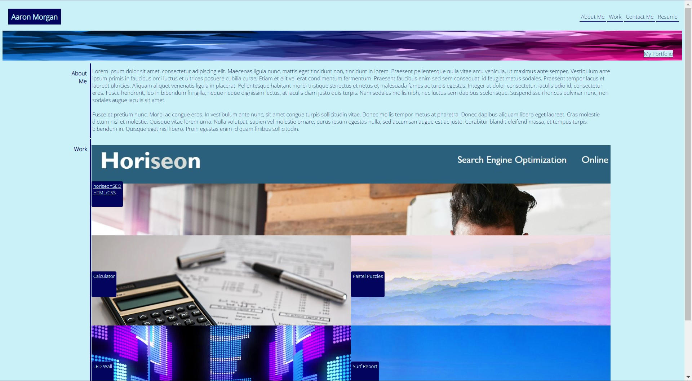

# Aaron Morgan Porfolio

## Description

This project is to demonstrate the advanced CSS and HTML concepts that I have learned so far. This webpage is a mockup and displays no personal information but rather what I can do as a web dev. The page has been designed to be responsive, illustrate the use of flex-box properties, variables, and other various CSS properties as shown in the repo.

See below for the screenshot of the product.

URL: https://craymorgana.github.io/horiseonSEOChallenge/

## Installation

N/A

## Usage

N/A

## Credits

N/A

## License

MIT License

Copyright (c) 2022 Aaron Morgan

Permission is hereby granted, free of charge, to any person obtaining a copy
of this software and associated documentation files (the "Software"), to deal
in the Software without restriction, including without limitation the rights
to use, copy, modify, merge, publish, distribute, sublicense, and/or sell
copies of the Software, and to permit persons to whom the Software is
furnished to do so, subject to the following conditions:

The above copyright notice and this permission notice shall be included in all
copies or substantial portions of the Software.

THE SOFTWARE IS PROVIDED "AS IS", WITHOUT WARRANTY OF ANY KIND, EXPRESS OR
IMPLIED, INCLUDING BUT NOT LIMITED TO THE WARRANTIES OF MERCHANTABILITY,
FITNESS FOR A PARTICULAR PURPOSE AND NONINFRINGEMENT. IN NO EVENT SHALL THE
AUTHORS OR COPYRIGHT HOLDERS BE LIABLE FOR ANY CLAIM, DAMAGES OR OTHER
LIABILITY, WHETHER IN AN ACTION OF CONTRACT, TORT OR OTHERWISE, ARISING FROM,
OUT OF OR IN CONNECTION WITH THE SOFTWARE OR THE USE OR OTHER DEALINGS IN THE
SOFTWARE.

## Badges

N/A

## Features

N/A

## How to Contribute

N/A

## Tests

N/A